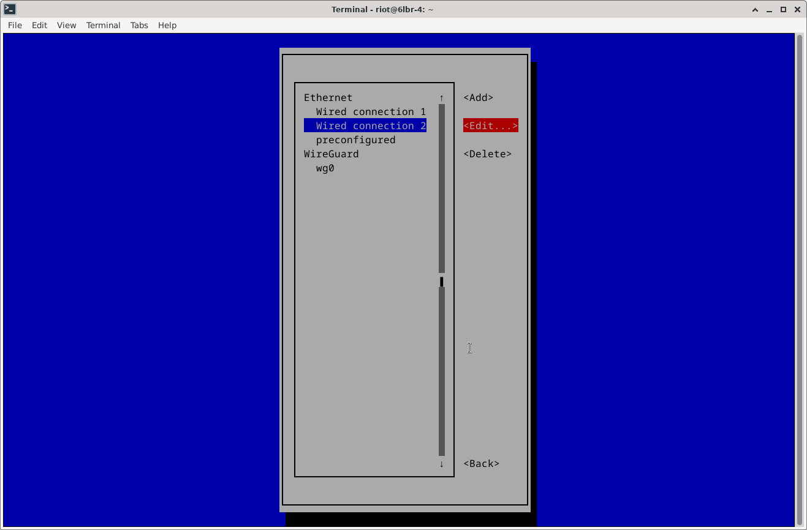
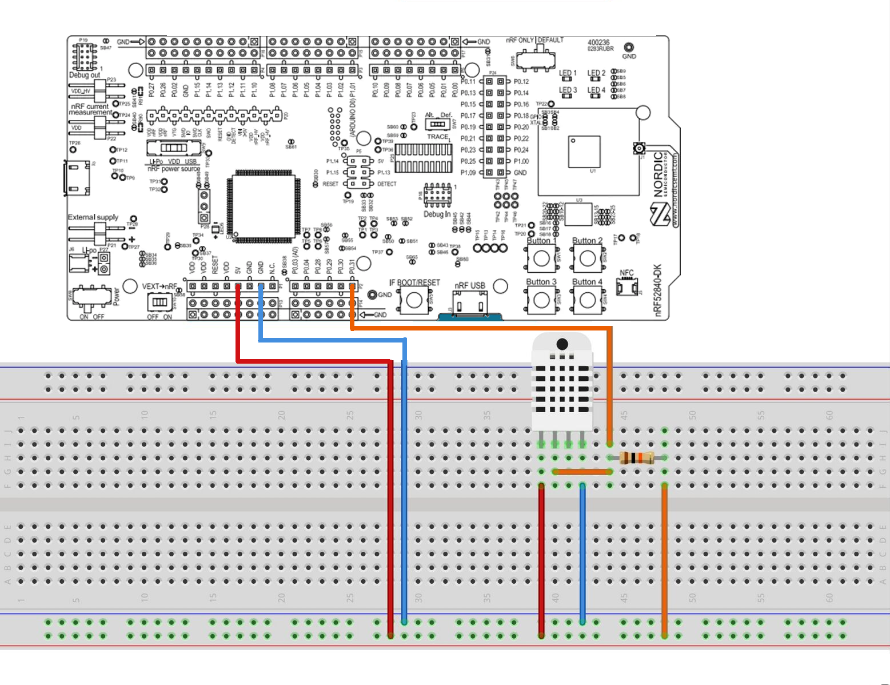
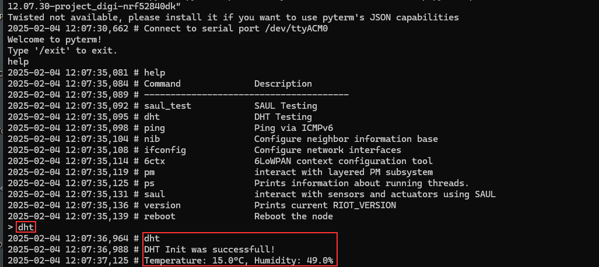

# Text Your IoT Device

In this project, a software solution was developed that enables communication between a microcontroller (nrf52840-dk) and an end user on his device using an instant messenger (in this case Telegram). Based on the open-source IoT operating system RIOT, we created a server-client architecture to make sensor values of the microcontroller accessible. We further tested the software on the nrf52840-dk, and leveraged Ollama for natural language processing while tracking changes via Git.
The project was carried out for the Project Digitalization "Text your IoT Device" in the winter term 24/25 at the Frankfurt University of Applied Sciences. 

## Prerequisites

Before starting the project you will need the following hard- and software components:
- nrf52840-dk microcontroller
- nrf52840dongle
- Raspberry Pi + ethernet cable
- DHT11 Sensor + Breadboard + 10k resistor & cables to connect
- computer that can run RIOT OS (https://doc.riot-os.org/getting-started.html)

## Setting Up the Dongle

1. **Before setting up, make sure there are no other devices connected to the PC and the dongle is plugged in.**
2. Clone the repository:
   ```sh
   git clone https://github.com/AllRIOT/RIOT.git
   ```
3. Navigate into the repository and open the example `gnrc_border_router`.
   ```sh
   RIOT/examples/gnrc_border_router
   ```
4. Before flashing, ensure that the following variable is set in the Makefile:
   ```sh
   DEFAULT_CHANNEL = 14
   ```
   If the value is not set, add it to the beginning of the Makefile.
5. Run the command:
   ```sh
   make flash BOARD=nrf52840dongle
   ```
6. After execution, the message `Device programmed` should appear.
7. Remove the nrf52840dongle from your computer and plug it into your Raspberry Pi.
8. Connect a ethernet cable to your Raspberry Pi and power it on.
9. Connect via SSH using the public IP of the Raspberry Pi and login using your credentials and specifying the correct network interface e.g.:
   ```sh
   ssh riot@2001:470:7347:c400:1000::%eno2
   ```
10. Run the command:
   ```sh
   ifconfig
   ```
   - 
   The command should list the interface `usb0`.
   
11. Run the command:
   ```sh
   sudo nmtui
   ```
   - 
   - You should see the starting screen of nmtui.
   - 
   - Select "Edit a connection". Choose the one corresponding to `usb0` (in our case, "Wired connection 2" and verify in the "Device" field).
   - 
   - Click "Edit" and navigate to IPv6-Connection.
   - 
   - Select "Manual" and click "Show".
   - 
   - 
   - Under "Addresses", click "Add" and use the public IP of the Pi, changing the last bit.
   - 
   - 
   - Finally, scroll down and click "OK".
   - 
   - You can now close nmtui.
12. Restart the Pi using:
   ```sh
   sudo shutdown -r now
   ```
13. After restarting, connect to your Raspberry Pi (see step 9.). Run the command:
    ```sh
    ifconfig
    ```
    - Verify that the `usb0` interface now has the manually set IP.
    - 
14. Your border router should now be ready to go.

## Setting Up the Telegram Bot

### Prerequisites

Before you begin, ensure you have met the following requirements:

- `curl` is installed on your machine.
- This repository is cloned [Text your IoT Device](https://github.com/Niinnoo/text_your_iot_device_project).
- You have a Telegram bot token. If you don't have one, create a bot and get the token from [BotFather](https://core.telegram.org/bots#botfather).
- Have the newest version of Python installed.
- Have the newest version of Pip installed.
- Install python3-venv
   ```sh
   sudo apt update
   sudo apt install python3-venv
   ```

### Installation

1. Connect via SSH using the public IP of the Raspberry Pi and login using your credentials and the correct network interface e.g.:
   ```sh
   ssh riot@2001:470:7347:c400:1000::%eno2
   ```
2. Install Ollama:
   ```sh
   curl -fsSL https://ollama.com/install.sh | sh
   ```
3. Pull the required model:
   ```sh
   ollama pull llama3.2:1b-instruct-q4_0
   ```
4. In the repository navigate to `telegram_bot`:
   ```sh
   cd telegram_bot
   ```
5. Create a virtual environment:
   ```sh
   python3 -m venv <name>
   ```
6. Activate the virtual environment and install dependencies:
   ```sh
   source <name>/bin/activate
   pip install -r requirements.txt
   ```
   - If an error occurs (see screenshot), perform the following steps:
     ```sh
     sudo apt update
     sudo apt full-upgrade
     sudo apt-get install autoconf
     pip install autoconf
     pip install --upgrade pip setuptools wheel
     sudo apt install libssl-dev
     pip install --upgrade cyphon
     sudo apt install python3-dev python3-pip python3-venv
     ```
   - 
7. Replace the `YOUR_TOKEN` placeholder with your actual Telegram bot token in `telegram_bot.py`:
   ```python
   application = Application.builder().token("YOUR_TOKEN").build()
   ```

## Setting Up the IoT Device

1. **Before setting up, make sure there are no other devices connected to the PC.**
2. Clone the RIOT repository on your computer:
   ```sh
   git clone https://github.com/RIOT-OS/RIOT.git
   ```
3. Set the following environment variables (absolute path to the RIOT folder):
   ```sh
   export RIOTMAKE='/home/<user>/RIOT/makefiles' # if repository was cloned to users root directory
   export RIOTBASE='/home/<user>/RIOT' # if repository was cloned to users root directory
   ```
4. Connect the DHT11 sensor to your IOT Device:
   - 
   - Make sure that the data pin of the DHT11 sensor is connected to the P0.31 pin on the IOT Device.
5. Connect your IOT Device to your computer.
6. (Optionally): Change the PSK_DEFAULT_IDENTITY and PSK_DEFAULT_KEY:
   - These are the credentials for the communication between the border router and the IOT Device.
   - Default value is `test` for both.
   - In our repository head to tinydtls_keys.h and change the values in lines 33 and 34.
   ```sh
   33  #define PSK_DEFAULT_IDENTITY "test"
   34  #define PSK_DEFAULT_KEY "test"
   ```
7. Navigate to the `text_your_iot_device_project` repository folder and execute:
   ```sh
   make flash term BOARD=nrf52840dk
   ```
8. The serial interface of the `nrf52840dk` will open.
9. Run `ifconfig` and note the global IP for later use.
   - 
10. Check if the external sensor is working with:
   ```sh
   dht
   ```
   - If correctly connected, it will output the current temperature and humidity.
   - 
11. Exit the serial interface using `Ctrl + C`. The IOT Device is now set up and can be placed at a suitable location.

### Unlocking the nrf52840-dk

When your nrf52840-dk gets locked and you're not able to flash it, use the following command to unlock it.
   ```sh
   openocd -c 'interface jlink; transport select swd; \
   source [find target/nrf52.cfg]' -c 'init'  -c 'nrf52_recover'
   ```

## Setting Global Values
Start by connecting to your Raspberry Pi via SSH.
1. Set the following global environment variables (replace `test` with the new values if default values have been changed):
   ```sh
   PSK_IDENTITY='test' # if changed to another value than `test` head to tinydtls_keys.h and modify the PSK_DEFAULT_IDENTITY in line 33 accordingly
   PSK_KEY='test' # if changed to another value than `test` head to tinydtls_keys.h and modify the PSK_DEFAULT_KEY in line 34 accordingly
   BOT_AUTH_PASSWORD='test' # Pick a secure password. This password will be used to authenticate yourself in telegram
   COAP_SERVER_IP='<IP_OF_IOT_DEVICE>' # Use the previously noted global IP of the IOT Device - **Setting Up the IoT Device**
   ```
   To set the environment variables permanently:

   1. Open the `.bashrc` file:
      ```sh
      nano ~/.bashrc
      ```
   2. Add the following lines at the end of the file (replace `test` with the desired values):
      ```sh
      export PSK_IDENTITY='test' # if changed to another value than `test` head to tinydtls_keys.h and modify the PSK_DEFAULT_IDENTITY in line 33 accordingly
      export PSK_KEY='test' # if changed to another value than `test` head to tinydtls_keys.h and modify the PSK_DEFAULT_KEY in line 34 accordingly
      export BOT_AUTH_PASSWORD='test' # Pick a secure password. This password will be used to authenticate yourself in telegram
      export COAP_SERVER_IP='<IP_OF_IOT_DEVICE>' # Use the previously noted global IP of the IOT Device - **Setting Up the IoT Device**
      ```
   3. Apply the changes:
      ```sh
      source ~/.bashrc
**NOTE: if PSK_IDENTITY and/or PSK_KEY are changed after flashing of the IOT Device (## Setting Up the IoT Device) tinydtls_keys.h has to be modified and the IOT Device has to be flashed again.**

## Setup for automatic start of the Telegram Bot after booting

1. On the raspberry pi run
   ```sh
   sudo nano /etc/systemd/system/<my_script>.service # replace <my_script> with your preferred service name
   ```
2. Copy the following text into the created .service file:
   ```sh
   [Unit]
   Description=My Telegram Bot
   After=network.target

   [Service]
   User=<YOUR_USERNAME> # Replace with your username
   Group=<YOUR_USERNAME> # Replace with your username
   WorkingDirectory=/home/<USERNAME>/text_your_iot_device_project/telegram_bot #absolute path to our repository text_your_iot_device_project/telegram_bot
   ExecStart=/home/<USERNAME>/text_your_iot_device_project/telegram_bot/<VENV_NAME>/bin/python3 /home/<USERNAME>/text_your_iot_device_project/telegram_bot/telegram_bot.py #absolute path to the venv python3 file and after that the absolute path to the telegram_bot.py script
   Restart=always

   Environment="PSK_IDENTITY=test" # if changed to another value than `test` head to tinydtls_keys.h and modify the PSK_DEFAULT_IDENTITY in line 33 accordingly
   Environment="PSK_KEY=test" # if changed to another value than `test` head to tinydtls_keys.h and modify the PSK_DEFAULT_KEY in line 34 accordingly
   Environment="BOT_AUTH_PASSWORD=test" # Pick a secure password. This password will be used to authenticate yourself in telegram
   Environment="COAP_SERVER_IP=<IP_OF_IOT_DEVICE>" # Use the previously noted global IP of the IOT Device - **Setting Up the IoT Device**

   [Install]
   WantedBy=multi-user.target
   ```

3. Start the Service using:
   ```sh
   sudo systemctl start <MY_SCRIPT>.service
   ```
4. Enable the service to be run after boot up using:
   ```sh
   sudo systemctl enable <MY_SCRIPT>.service
   ```
5. To check if everything is running correctly:
   ```sh
   sudo systemctl status <MY_SCRIPT>.service
   ```
6. To disable or stop the service use the following commands respectivly:
   ```sh
   sudo systemctl disable <MY_SCRIPT>.service
   sudo systemctl stop <MY_SCRIPT>.service
   ```
