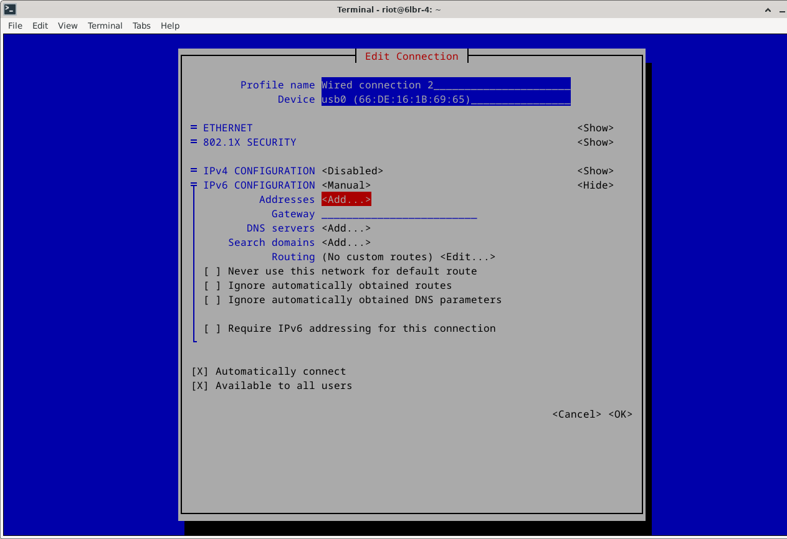

# Text Your IoT Device

In this project, a software solution was developed that enables a microcontroller-based IoT device to be accessible via an instant messenger (here Telegram). Using the open-source IoT operating system RIOT, we created firmware for smart objects, evaluated the software on real IoT hardware over IPv6, and leveraged Ollama for natural language processing while collaborating via Git.

## Setting Up the Dongle

1. **Before setting up, make sure there are no other devices connected to the PC.**
2. Clone the repository:
   ```sh
   git clone https://github.com/AllRIOT/RIOT.git
   ```
3. Navigate into the repository and open the example `gnrc_border_router`.
   ```sh
   RIOT/examples/gnrc_border_router
   ```
4. Before flashing, ensure that the following variable is set in the Makefile:
   ```sh
   DEFAULT_CHANNEL = 14
   ```
   If the value is not set, add it to the beginning of the Makefile.
   
6. Run the command:
   ```sh
   make flash BOARD=nrf52840dongle
   ```
7. After execution, the message `Device programmed` should appear.
8. Connect via SSH using the public IP of the Raspberry Pi e.g.:
   ```sh
   ssh riot@2001:470:7347:c400:1000::
   ```
9. Run the command:
   ```sh
   sudo nmtui
   ```
   - 
   - Select "Edit a connection". Choose the one corresponding to `usb0` (in our case, "Wired connection 2" and verify in the "Device" field).
   - 
   - Click "Edit" and navigate to IPv6-Connection.
   - 
   - Select "Manual" and click "Show".
   - 
   - 
   - Under "Addresses", click "Add" and use the public IP of the Pi, changing a single bit.
   - 
   - 
   - Finally, scroll down and click "OK".
   - 
10. Restart the Pi using:
   ```sh
   sudo shutdown -r now
   ```
11. After restarting, check with:
    ```sh
    ifconfig
    ```
    - Verify that the `usb0` interface now has the manually set IP.
    - 

## Setting Up the Telegram Bot

### Prerequisites

Before you begin, ensure you have met the following requirements:

- `curl` is installed on your machine.
- This repository is cloned.
- You have a Telegram bot token. If you don't have one, create a bot and get the token from [BotFather](https://core.telegram.org/bots#botfather).

### Installation

1. **Install Ollama:**
   ```sh
   curl -fsSL https://ollama.com/install.sh | sh
   ```
2. **Pull the required model:**
   ```sh
   ollama pull llama3.2:1b-instruct-q4_0
   ```
3. **Clone the repository:**
   ```sh
   git clone <repository_url>
   cd telegram_bot
   ```
4. **Create a virtual environment:**
   ```sh
   python3 -m venv <name>
   ```
5. **Activate the virtual environment and install dependencies:**
   ```sh
   source <name>/bin/activate
   pip install -r requirements.txt
   ```
   - If an error occurs (see screenshot), perform the following steps:
     ```sh
     sudo apt update
     sudo apt full-upgrade
     sudo apt-get install autoconf
     pip install autoconf
     pip install --upgrade pip setuptools wheel
     sudo apt install libssl-dev
     pip install --upgrade cyphon
     sudo apt install python3-dev python3-pip python3-venv
     ```
   - 
6. **(XX Ist das noch so?) Replace the `YOUR_TOKEN` placeholder with your actual Telegram bot token in `telegram_bot.py`:**
   ```python
   application = Application.builder().token("YOUR_TOKEN").build()
   ```

## Setting Up the IoT Device

1. **Clone the RIOT repository:**
   ```sh
   git clone https://github.com/RIOT-OS/RIOT.git
   ```
2. **XX (Erst unser project öffnen und dann dort das hier machen oder?) Set the following environment variables (absolute path to the RIOT folder):**
   ```sh
   export RIOTMAKE='/home/user/RIOT/makefiles'
   export RIOTBASE='/home/user/RIOT'
   ```
   XX hier nochmal ne Doku mit den Bildern für das Anschließen von DHT11?
3. **Navigate to the repository folder and execute:**
   ```sh
   make flash term BOARD=nrf52840dk
   ```
4. **The console of the `nrf52840dk` will open.**
5. **Run `ifconfig` and note the global IP for later use.**
6. **Check if the external sensor is working with:**
   ```sh
   dht
   ```
   - If correctly connected, it will output the current temperature and humidity.
7. **Exit the terminal using `Ctrl + C`. The MCU is now set up and can be placed at a suitable location.**

## Setting Global Values

Set the following global environment variables XX(in this repository?):

```sh
PSK_IDENTITY
PSK_KEY
BOT_AUTH_PASSWORD
COAP_SERVER_IP
```

To set these values permanently:

1. **Open the `.bashrc` file: XX (unter der Bedingung, dass man in unserem Repo ist?)**
   ```sh
   nano ~/.bashrc
   ```
2. **Add the following lines at the end of the file (replace `test` with the desired values):**
   ```sh
   export PSK_IDENTITY='test'
   export PSK_KEY='test'
   export BOT_AUTH_PASSWORD='test' # Pick a secure password
   export COAP_SERVER_IP='test'  # Use the previously noted global IP of the MCU
   ```
3. **Apply the changes:**
   ```sh
   source ~/.bashrc

## Setup for automatic start of the Telegram Bot after booting
On the raspberry pi run 
```sh
sudo nano /etc/systemd/system/mein_skript.service
```
copy the following text into the create .service file <br />
[Unit] <br />
Description=My Telegram Bot <br />
After=network.target <br />
 <br />
[Service] <br />
User=digi4 <br />
Group=digi4 <br />
WorkingDirectory=/home/digi4/project_digi/telegram_bot <br />
ExecStart=/home/digi4/project_digi/telegram_bot/digi/bin/python3 /home/digi4/project_digi/telegram_bot/telegram_bot.py <br />
Restart=always <br />
 <br />
Environment="BOT_AUTH_PASSWORD=test" <br />
Environment="COAP_SERVER_IP=2001:470:7347:c418:dc87:cc0f:aa52:2559" <br />
Environment="PSK_KEY=test" <br />
Environment="PSK_IDENTITY=test" <br />
 <br />
[Install] <br />
WantedBy=multi-user.target <br />

Start the Service using:
```sh
sudo systemctl start telegram_bot.service
```
Enable the service to be run after boot up using:
```sh
sudo systemctl enable telegram_bot.service
```
To check if everything is running correctly:
```sh
sudo systemctl status telegram_bot.service
```
To disable or stop the service use the following commands respectivly:
```sh
sudo systemctl disable telegram_bot.service
sudo systemctl stop telegram_bot.service
```

 <br />
for us <br />
/home/digi4/project_digi/telegram_bot/digi/bin/python3 <br />
/home/digi4/project_digi/telegram_bot/telegram_bot.py <br />
